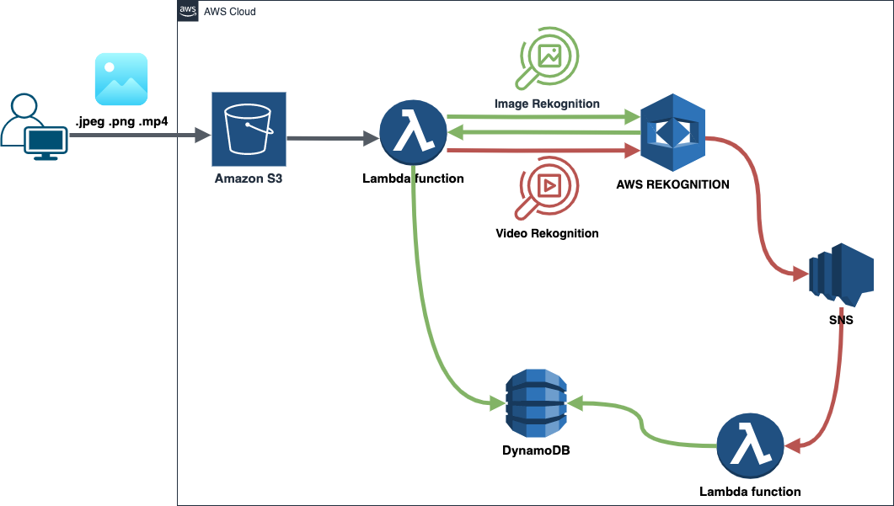

<br />
<div align="center">
  <h3 align="center">Project Myauto -> Recognise -> DynamoDb</h3>
  <p align="center">
    download,uplooad, analyse myauto images with AWS Recognition and save to DynamoDb.
    <br />
  </p>
</div>

<!-- ABOUT THE PROJECT -->

## Project Structure



<!-- GETTING STARTED -->

## Installation

### Look for LabRole ARN and update the

`configuration.json`

### Create `.env` file and insert aws credentials

### Install or update the [AWS CLI](https://docs.aws.amazon.com/cli/latest/userguide/getting-started-install.html)

### Configure AWS credentials: Once the AWS CLI is installed, open a command prompt or terminal and run the following command :

```cmd
aws configure
```

### Add some other credentials in file credentials. Help -> [AWS credentials configure](https://docs.aws.amazon.com/sdkref/latest/guide/file-location.html)

### Install python requirements

Recomendation: use virtual environment for python.

```cmd
pip install -r requirements.txt
```

### Install ServerLess framework

We need to install serverless framework.

```cmd
npm install serverless
```

### Deploy your lambda function

Move to `/rekognition` folder

```cmd
cd rekognition
```

Run the following command to install the Serverless Python Requirements plugin:

```cmd
..\node_modules\.bin\serverless plugin install -n serverless-python-requirements
```

Run

```cmd
..\node_modules\.bin\serverless deploy
```

change directory to main folder

```cmd
cd ..
```

<!-- USAGE EXAMPLES -->

## Usage

### Download Images

Run

```cmd
python source/myauto.py
```

### Upload Images and it will do other magic tricks...

Run

```cmd
python source/main.py bucket --name taskbtu -u
```

### Note! : check result in DynamoDB
